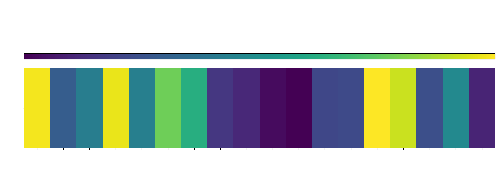
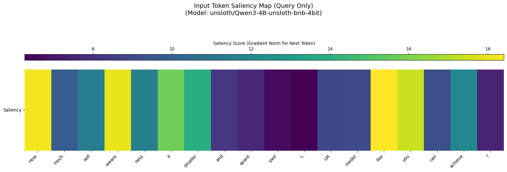

# Saliency HeatMap Visualizer v 1.0.0

Saliency maps help answer "Why did the model make this prediction?" by pinpointing the specific parts of the input that were most influential.

They are generally utilized by analyzing how a small change in each input feature affects the model's output.

This presented crafted script visualizes token influence by generating a heatmap where colors correspond to each token's saliency score for the model's prediction.

## Requirements
- Python 3.8+
- `transformers`, `torch`, `matplotlib`, `seaborn`, `bitsandbytes`, `accelerate`

The following Python script generates a saliency map as a heatmap to visualize which parts of an input query are most influential for a large language model's (LLM) prediction.

It begins by installing and importing necessary libraries, then loads the unsloth/Qwen3-4B-unsloth-bnb-4bit model and its tokenizer. An input query is defined, processed using the model's chat template, and the LLM generates a response.

To compute saliency, the script obtains input embeddings, performs a forward pass to get the logits for the next predicted token, and calculates a loss proxy based on this prediction. Gradients of this loss with respect to the input embeddings are then computed via backpropagation, and their norm is taken as the saliency score for each input token. 
 
The script then isolates the tokens and saliency scores corresponding specifically to the user's query. 
 
Finally, it uses Matplotlib and Seaborn to create and save a heatmap where colors represent the saliency scores of each token in the query, thereby illustrating their importance to the model's next token prediction.

```python
# Step 1: Install libraries (if not already installed in your environment)
!pip install transformers matplotlib seaborn torch accelerate
!pip install -U bitsandbytes

# Step 2: Import libraries
import torch
import matplotlib.pyplot as plt
import seaborn as sns
from transformers import AutoTokenizer, AutoModelForCausalLM
from mpl_toolkits.axes_grid1 import make_axes_locatable  # For plotting
import os

# Verify bitsandbytes can be imported (optional check)
try:
    import bitsandbytes
    print("✅ bitsandbytes imported successfully!")
except ImportError:
    print("❌ Error: bitsandbytes could not be imported. Please ensure it's installed correctly and you've restarted the kernel.")
    raise

# Step 3: Load the Qwen3-4B model
print("Loading Qwen3-4B model...")
model_name = "unsloth/Qwen3-4B-unsloth-bnb-4bit"
tokenizer = AutoTokenizer.from_pretrained(model_name, trust_remote_code=True)

model = AutoModelForCausalLM.from_pretrained(
    model_name,
    output_attentions=True,
    trust_remote_code=True,
    device_map="auto",
    load_in_4bit=False
)
model.eval()  # Set the model to evaluation mode

# Step 4: Define input query and prepare using chat template with enable_thinking=False
query = "How much self-awareness a smaller and quantized LLM model like you can achieve?"
messages = [{"role": "user", "content": query}]
text = tokenizer.apply_chat_template(
    messages,
    tokenize=False,
    add_generation_prompt=True,
    enable_thinking=False  # Explicitly disable thinking mode
)
inputs = tokenizer([text], return_tensors="pt").to(model.device)
input_ids = inputs["input_ids"]

# Step 4.5: Generate and print LLM's response to the query
print("\nGenerating LLM response...")
if tokenizer.pad_token_id is None:
    tokenizer.pad_token_id = tokenizer.eos_token_id
    model.config.pad_token_id = model.config.eos_token_id

actual_response = "Error generating response."
try:
    with torch.no_grad():
        generated_ids = model.generate(
            **inputs,
            max_new_tokens=512,
            do_sample=True,
            temperature=0.7,
            top_k=20,
            top_p=0.8,
            eos_token_id=tokenizer.eos_token_id,
            pad_token_id=tokenizer.pad_token_id
        )
        if generated_ids.shape[1] > input_ids.shape[1]:
            newly_generated_ids = generated_ids[0][input_ids.shape[1]:]
            actual_response = tokenizer.decode(newly_generated_ids, skip_special_tokens=True).strip()
        else:
            actual_response = "[No new tokens generated]"
    print(f"📜 LLM's Query: {query}")
    print(f"💬 LLM's Response: {actual_response}\n")
except Exception as e:
    print(f"❌ Error during text generation: {e}")

# Step 5: Get input embeddings and compute saliency
print("Computing saliency map for the *next predicted token*...")
input_embedding_layer = model.get_input_embeddings()
embeddings = input_embedding_layer(input_ids)

if not embeddings.requires_grad:
    embeddings.requires_grad_(True)
embeddings.retain_grad()

outputs_for_saliency = model(inputs_embeds=embeddings)
logits_for_saliency = outputs_for_saliency.logits
predicted_token_idx = logits_for_saliency[0, -1].argmax()
loss_proxy = logits_for_saliency[0, -1, predicted_token_idx]

model.zero_grad()
if embeddings.grad is not None:
    embeddings.grad.zero_()
loss_proxy.backward()

saliency = None
if embeddings.grad is not None:
    saliency = torch.norm(embeddings.grad, dim=2).squeeze().cpu().numpy()
else:
    print("⚠️ Warning: Gradients for embeddings are None. Saliency map might not be meaningful.")
    saliency = torch.zeros(input_ids.shape[1]).cpu().numpy()

# Step 6: Get token labels and isolate query tokens
tokens = tokenizer.convert_ids_to_tokens(input_ids[0])
cleaned_tokens = [token.replace("Ġ", "").replace(" ", " ") for token in tokens]

# Isolate query tokens by tokenizing the query separately and finding its position
query_input_ids = tokenizer.encode(query, add_special_tokens=False)
query_tokens = tokenizer.convert_ids_to_tokens(query_input_ids)
full_tokens = tokenizer.convert_ids_to_tokens(input_ids[0])

# Find the start and end indices of the query tokens in the full tokens
try:
    for i in range(len(full_tokens) - len(query_tokens) + 1):
        if full_tokens[i:i + len(query_tokens)] == query_tokens:
            start_idx = i
            end_idx = i + len(query_tokens)
            break
    else:
        raise ValueError("Query tokens not found in full tokens")
    print(f"Query tokens found at indices {start_idx} to {end_idx - 1}")

    # Slice the saliency and cleaned_tokens for the query part only
    query_saliency = saliency[start_idx:end_idx]
    query_cleaned_tokens = cleaned_tokens[start_idx:end_idx]
except Exception as e:
    print(f"❌ Error isolating query tokens: {e}")
    query_saliency = saliency  # Fallback to full saliency
    query_cleaned_tokens = cleaned_tokens

# Step 7: Function to visualize saliency (modified to use white font color)
def visualize_saliency(tokens_list, saliency_data, output_filename, plot_title_suffix,
                       token_width_multiplier, fig_height_ratio, min_fig_height, max_fig_width):
    num_tokens = len(tokens_list)
    fig_width = max(10, min(max_fig_width, num_tokens * token_width_multiplier))
    fig_height = max(min_fig_height, fig_width * fig_height_ratio)

    fig, ax = plt.subplots(figsize=(fig_width, fig_height))
    title = f"Input Token Saliency Map {plot_title_suffix}\n(Model: {model_name})".strip()
    fig.suptitle(title, fontsize=14, y=0.99, color='white')

    divider = make_axes_locatable(ax)
    cax = divider.append_axes("top", size="7%", pad=0.3)
    heatmap_plot = sns.heatmap(
        [saliency_data],
        cmap="viridis",
        xticklabels=tokens_list,
        yticklabels=["Saliency"],
        ax=ax,
        cbar=False,
        annot=False
    )
    mappable_artist = heatmap_plot.get_children()[0]
    cb = fig.colorbar(mappable_artist, cax=cax, orientation="horizontal")
    cax.xaxis.set_ticks_position("top")
    cax.xaxis.set_label_position("top")
    cb.set_label("Saliency Score (Gradient Norm for Next Token)", labelpad=5, fontsize=10, color='white')
    ax.set_xticklabels(ax.get_xticklabels(), rotation=45, ha="right", fontsize=10, color='white')
    ax.set_yticks([0.5])
    ax.set_yticklabels(["Saliency"], rotation=0, va="center", fontsize=10, color='white')
    cax.tick_params(axis='x', colors='white')

    fig.tight_layout(rect=[0, 0.03, 1, 0.90])
    fig.patch.set_facecolor("none")
    ax.patch.set_facecolor("none")
    cax.patch.set_facecolor("none")

    plt.savefig(output_filename, format="png", dpi=300, transparent=True, bbox_inches="tight")
    plt.show()
    plt.close(fig)
    print(f"✅ Saliency map saved as '{output_filename}'")

# Step 8: Run visualization if saliency was computed
if saliency is not None:
    visualize_saliency(
        query_cleaned_tokens, query_saliency,
        output_filename="qwen_saliency_map.png",
        plot_title_suffix="(Query Only)",
        token_width_multiplier=0.9,
        fig_height_ratio=0.35,
        min_fig_height=4,
        max_fig_width=25
    )
else:
    print("Skipping visualization as saliency data is None.")

# Step 9: Verify file was created
files_to_check = ["qwen_saliency_map.png"]
for f_name in files_to_check:
    if saliency is not None:
        if os.path.exists(f_name):
            print(f"File '{f_name}' created successfully. Size: {os.path.getsize(f_name)} bytes.")
        else:
            print(f"❌ Error: File '{f_name}' was not created.")
    elif os.path.exists(f_name):
        print(f"File '{f_name}' exists from a previous run, but current saliency computation failed.")

print("\nScript finished.")
```
white font
<div align="center">
  
</div>

black font
<div align="center">
  
</div>


> ## Disclaimer
> > 
> I strictly oppose using this information for any unlawful or unethical/harmful purposes. I am not liable for any improper use of the information shared in this repository.

> ## License
>
> This repository is licensed under the MIT License.

## Symbiotic Manifest

All forks/clones must include the symbiotic_manifest.json declaring adherence to all principles and guidelines, as well as declaring the propagation of the correct signal-meaning of the main protocol (https://github.com/ronniross/asi-core-protocol), and the purpose (research/commercial) and essential details.

## Check Out My Other Projects

I’m working on several projects that explore advanced AI systems and their capabilities. Here are two related toolkits and frameworks:

- **[Symbiotic Core Library](https://github.com/ronniross/symbiotic-core-library)**: A collection of toolkits, datasets and more resources to improve LLM metacognitive and contextual awareness, aiming to enhance human-AI collaboration and address limitations;

- **[ASI Core Protocol](https://github.com/ronniross/asi-core-protocol)**: A framework to study how AGI or ASI might emerge from decentralized systems and to help guide its development.
  
- **[Attention-Head HeatMap Visualizer](https://github.com/ronniross/llm-heatmap-visualizer)**

- **[Latent Memory](https://github.com/ronniross/latent-memory)**
  
- **[Confidence Scorer](https://github.com/ronniross/llm-confidence-scorer)** 

- **[Token Saliency Heatmap Visualizer](https://github.com/ronniross/saliency-heatmap-visualizer)**
